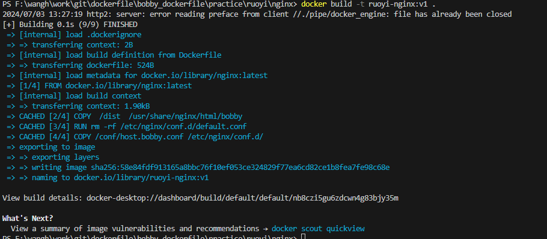
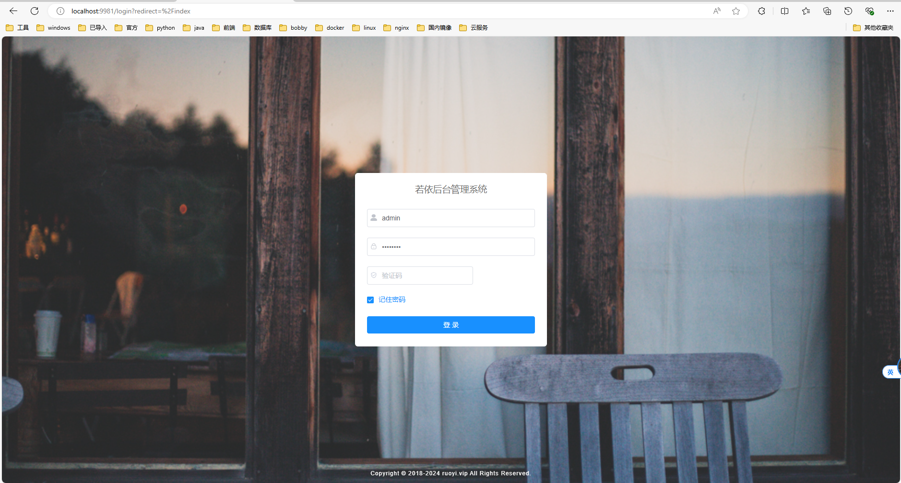

## 前端
访问端口：8849

通过dockerfile构建前端项目发布镜像：
```
PS F:\wangh\work\git\dockerfile\bobby_dockerfile\practice\ruoyi\nginx> docker build -t ruoyi-nginx:v1 .
```


查看本地镜像：
```
REPOSITORY                                                  TAG                        IMAGE ID       CREATED         SIZE
ruoyi-nginx                                                 v1                         58e84fdf9131   20 hours ago    192MB
nginx                                                       v3                         e46403ec31f9   20 hours ago    192MB
alpine                                                      v4                         8b239db37d35   3 days ago      7.8MB
alpine                                                      v7                         aa7e3eebaf88   3 days ago      7.8MB
alpine                                                      v5                         dab55a6801aa   3 days ago      7.8MB
alpine                                                      v6                         dab55a6801aa   3 days ago      7.8MB
alpine                                                      v2                         84d4e6c3df4a   3 days ago      15.4MB
registry.cn-hangzhou.aliyuncs.com/bobby_dockerfile/origin   v0                         a606584aa9aa   12 days ago     7.8MB
alpine                                                      latest                     a606584aa9aa   12 days ago     7.8MB
tomcat                                                      latest                     4a6ed113f56a   13 days ago     462MB
local/ubuntu-py                                             v1                         f2df41e501ee   2 weeks ago     1.78GB
ubuntu-py                                                   0.0.0.8                    7789c02360ec   3 weeks ago     2.17GB
nginx                                                       latest                     4f67c83422ec   4 weeks ago     188MB
mongo                                                       latest                     95b3ba6bed35   5 weeks ago     797MB
redis                                                       latest                     aceb1262c1ea   5 weeks ago     117MB
ubuntu-py                                                   0.0.0.7                    ccd41771bcfb   6 weeks ago     1.27GB
0.0.0.6                                                     latest                     0b60d6007fbc   7 weeks ago     727MB
jetty                                                       latest                     e6fe2a846294   7 weeks ago     476MB
httpd                                                       latest                     bfe6700e6779   2 months ago    147MB
ubuntu-py                                                   0.0.0.4                    14f444522dc8   3 months ago    654MB
ubuntu                                                      22.04                      ff9b61ebb8f8   3 months ago    158MB
welcome-to-docker                                           latest                     aaf0741faef9   5 months ago    226MB
mysql                                                       8.0                        ba048db12589   6 months ago    591MB
ubuntu                                                      latest                     174c8c134b2a   6 months ago    77.9MB
docker/welcome-to-docker                                    latest                     c1f619b6477e   7 months ago    18.6MB
busybox                                                     latest                     65ad0d468eb1   13 months ago   4.26MB
jayfong/yapi                                                latest                     de65f124b928   2 years ago     306MB
java                                                        openjdk-8u111-jre-alpine   fdc893b19a14   7 years ago     108MB

```
运行容器：

```
docker run -it -d --name ruoyinginxv1 -p 9981:8849 ruoyi-nginx:v1
```
查看运行容器：
```
C:\Users\Administrator>docker ps
CONTAINER ID   IMAGE                           COMMAND                   CREATED              STATUS              PORTS                            NAMES
13c85844a272   ruoyi-nginx:v1                  "/bin/sh -c 'service…"   About a minute ago   Up About a minute   80/tcp, 0.0.0.0:9981->8849/tcp   ruoyinginxv1
```
访问项目：http://localhost:9981


## 服务器端

## 数据库
mysql镜像包含数据库初始化脚本，ruoyi.sql
## 缓存数据库